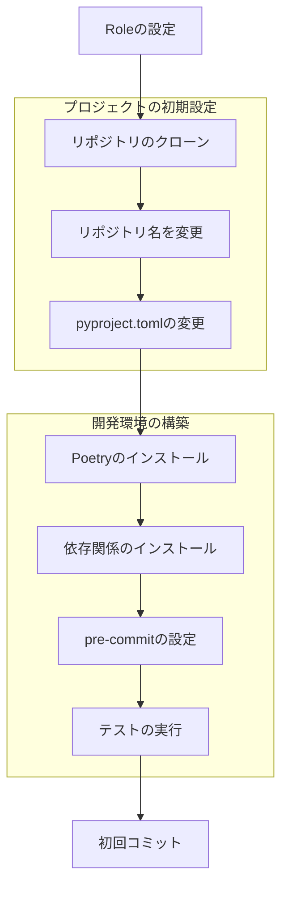
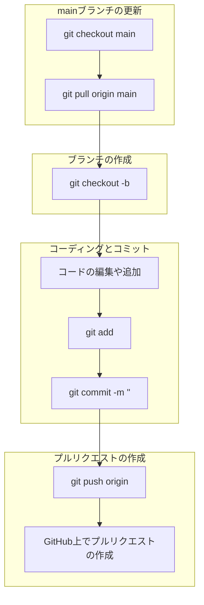

# myproject

TODO: ここに myproject の解説を記載します。

## インストール

TODO: インストール方法を記載します。

## 使用方法

TODO: ユーザー向けの使用方法を記載します。

## 開発者向け

### プロジェクト開始時の作業 (TODO: この章は完了したら削除してください)

#### 概要

[開発リポジトリ テンプレート 利用ガイド](https://docs.google.com/presentation/d/e/2PACX-1vTveb1yv4tdloyvD2AFuVcGnQ_Zbn8X-LfG8teautpbP8N65fuHUG4CrUrww9BgaA/pub?start=false&loop=false&delayms=3000)




#### 役割の設定

Developer, Reviewer, Merger の 3 つの役割にメンバーを割り当てます。

#### このリポジトリをクローン

このリポジトリをクローンします。

#### リポジトリ名を変更

リポジトリ名に合わせて以下の手順で変更します。
以下では yourproject というリポジトリ名に変更する手順を示します。

```bash
# myproject-template ディレクトリを yourproject に変更します。
mv myproject-template yourproject
cd yourproject
# .git ディレクトリを削除する
rm -rf .git
# myproject という文字列を検索して全て yourproject に置換する。
grep -rl 'myproject' . | xargs sed -i 's/myproject/yourproject/g'
# myproject という文字列を全て yourproject に置換する。
/usr/bin/find . -depth -name '*myproject*' | while read f; do      mv "$f" "$(dirname "$f")/$(basename "$f" | sed 's/myproject/yourproject/g')";  done
git init
rm -rf docs/*
rm poetry.lock
rm LICENSE
```

#### pyproject.toml の変更

Python のバージョンや、初期バージョンを修正します。

#### 開発環境の構築

開発環境の構築の章を参照してください。

#### 初回コミット

初回コミットを実施します。方法はこのページ末尾の資料を参照して下さい。

### 開発環境の構築

1. **Poetry のインストール**:
    - Poetry は Python の依存関係管理ツールです。以下のコマンドでインストールできます。
    ```bash
    curl -sSL https://install.python-poetry.org | python3 -
    ```

2. **プロジェクトのクローン**:
    - プロジェクトをローカルにクローンします。
    ```bash
    # git clone <リポジトリのリモートの URL>
    cd myproject
    ```

3. **依存関係のインストール**:
    - Poetry を使用してプロジェクトの依存関係をインストールします。
    ```bash
    poetry install
    ```

4. **pre-commit の設定**:
    - `pre-commit` を使用して、コミットするたびにテストやコードフォーマットが行われるようにします。このため、初回に以下のコマンドを実行して設定します。
    ```bash
    poetry run pre-commit install
    ```

5. **テストの実行**:
    - プロジェクトのテストを実行して、全てが正常に動作しているか確認します。
    ```bash
    poetry run pre-commit
    ```

### タスクの役割分担

開発メンバーは以下の役割を担当します。

- **Developer**: 機能や修正の開発を行います。
- **Reviewer**: プルリクエストのコードレビューを行います。
- **Merger**: レビューが完了したプルリクエストを `main` ブランチにマージします。

### 開発手順: GitHub Flow



1. **新しい機能や修正を開始する際のブランチ作成** (Developer):
    ```bash
    git checkout main
    git pull origin main
    git checkout -b <branch-name>
    ```

2. **ブランチでの作業** (Developer):
    - コミット手順に従って、コミットを作成します。

3. **プルリクエストの作成** (Developer):
    - PR の説明には、変更内容、変更の背景、テスト方法などを詳細に記載します。

4. **コードレビュー** (Reviewer):
    - 指摘や質問がある場合は、Developer がコードを修正し、再度レビューを依頼します。

5. **PR のマージ** (Merger):
    - 問題ないと判断されたら、`main` ブランチにマージします。

6. **デプロイ**:
    - `main` ブランチにマージされた変更は、本番環境にデプロイする準備が整ったものとみなします。

### バージョンアップ

- バージョンアップは、Merger が `main` ブランチに PR をマージした後、または定期的に行います。
- `poetry run cz bump` コマンドを用いてバージョンアップを行います。
- `main` ブランチでのみ実施してください。

### コミット手順

1. **初回コミットの手順**:
   初回コミットは commitizen を使用しません。
   初回コミットに対しては、バージョン用のタグを手動作成する必要があります。
   
    ```bash
    git add .
    git commit --allow-empty -m "first commit"
    git tag -a "0.1.0" -m "first version"
    ```

    上記のバージョンは `pyproject.toml` に合わせてください。
    なおバージョンのメジャーバージョンを 1 以上にする場合は、
    `pyproject.toml` の `major_version_zero = true` の行を削除してください。

3. **コミット**:
    ```bash
    git add <該当ファイル>
    poetry run pre-commit  # この結果により、修正や re-staging が必要なファイルが生じたら修正し git add し直してください。
    poetry run cz commit
    ```

### そのほかのガイド

1. **そのほかの指針**:
    - そのほかの開発の指針は `COMMIT_GUIDELINES.md` を参照してください。

